# BTCT/DOGE Decentralized Exchange (DEX)


**⚠️ DISCLAIMER: This is a reference implementation for educational purposes only.**

**Running this software in jurisdictions with Virtual Asset Service Provider (VASP) regulations may carry legal risks. The original developers do not operate any public instance of this software. Users are solely responsible for compliance with applicable laws and regulations.**

---

## Overview

A non-custodial, peer-to-peer atomic swap platform for exchanging BTCT (Bitcoin Time) and DOGE (Dogecoin) using Hash Time-Locked Contracts (HTLC).

### Key Features

- ✅ **Non-custodial**: Server never holds, accesses, or stores private keys
- ✅ **Trustless**: HTLC ensures atomic execution (all-or-nothing)
- ✅ **DOGE P2SH HTLC**: Dogecoin locked in P2SH scripts with hash lock + time lock
- ✅ **Zero fees**: Platform does not charge trading fees
- ✅ **Client-side signing**: All transactions signed in the browser
- ✅ **RPG Trading Town**: Multiplayer pixel-art town with Phaser 3 (trade at NPC bulletin board)
- ✅ **Mobile support**: Virtual joystick + action button for touch devices
- ✅ **1:1 trade chat**: Per-trade WebSocket chat with auto-delete
- ✅ **Rate limiting**: Built-in AML compliance measures (50,000 BTCT/24h per wallet)
- ✅ **Open source**: Auditable code (MIT License)

---

## Architecture

```mermaid
flowchart TB
    subgraph Browser["🌐 Browser (Client-Side)"]
        PK["🔑 Private Keys\n(localStorage)"]
        SIGN["✍️ Transaction Signing\n(krypton-offline.js / bitcore-doge.js)"]
        HTLC["🔒 HTLC Contracts\n(BTCT + DOGE P2SH)"]
        TOWN["🎮 RPG Town\n(Phaser 3 Multiplayer)"]
    end

    subgraph Backend["⚙️ Backend (Node.js)"]
        DB["🗄️ PostgreSQL\nTrade Listings"]
        WS["💬 WebSocket\nChat + Multiplayer"]
        RELAY["📡 Blockchain\nRPC Relay"]
    end

    subgraph Blockchain["⛓️ Blockchain Nodes"]
        BTCTNODE["₿ BTCT Full Node\n(RPC :12211)"]
        DOGELOCAL["🐕 Dogecoin Core\nPruning Node\n(Broadcast)"]
        DOGEAPI["☁️ Blockcypher API\n(UTXO / Balance)"]
    end

    Browser -- "HTTPS / WSS" --> Backend
    Backend --> DB
    Backend --> WS
    Backend --> RELAY
    RELAY --> BTCTNODE
    RELAY --> DOGELOCAL
    RELAY --> DOGEAPI
```



**DOGE Hybrid Architecture:**
- **Broadcast**: Local Dogecoin Core pruning node RPC (`sendrawtransaction`)
- **UTXO/Balance**: Blockcypher API (pruning node cannot query external addresses)

---

## Prerequisites

- **Node.js** >= 18.0.0 (LTS 18.x recommended — most stable with bitcoinkrypton-seed)
- **PostgreSQL** >= 12
- **BTCT Full Node** (bitcoinkrypton-seed)
- **Dogecoin Core** >= 1.14.9 (optional, for local broadcast)
- **PM2** (optional, for production)

---

## Pre-Installation Checklist

Before following this guide, prepare these 3 things to avoid getting stuck mid-way:

- **Domain name**: Required if you want SSL (e.g. `dex.yourdomain.com`). Make sure the domain's **DNS A record already points to your server's public IP** before running certbot — SSL issuance will fail otherwise. If you don't have a domain, skip the SSL/Nginx section and access via IP directly (`http://YOUR_IP:3030`).

- **Blockcypher API token**: Needed for DOGE balance/UTXO queries. Get a free token at [https://accounts.blockcypher.com/signup](https://accounts.blockcypher.com/signup) before starting. The free plan (200 req/hr) is sufficient for testing.

- **BTCT full node synced**: The BTCT node (`bitcoinkrypton-seed`) must be running and **fully synchronized** before trades will display correctly. Block sync can take time — start it first while completing the rest of the setup.

- **Port availability**: Make sure ports `3030` (DEX server) and `12211` (BTCT RPC) are not already in use:
  ```bash
  netstat -tulpn | grep -E '3030|12211'
  ```
  No output means the ports are free.

---

## Installation

### 1. Clone the repository
```bash
git clone https://github.com/timessanta/btct-doge-dex.git
cd btct-doge-dex
```

### 2. Install dependencies
```bash
npm install
```

### 3. Configure environment
```bash
cp .env.example .env
nano .env
```

Edit `.env` with your configuration:
```env
PORT=3030
DB_HOST=localhost
DB_NAME=btct_dex
DB_USER=exchange
DB_PASSWORD=your_secure_password

# Optional: Admin panel
ADMIN_ID=admin
ADMIN_PASSWORD_HASH=$2b$10$... (use bcrypt)
JWT_SECRET=your_random_32char_secret

# Blockcypher API token for DOGE UTXO/balance queries
# Free: 200 req/hr | With token: 2000 req/hr
# Sign up at: https://accounts.blockcypher.com/signup
BLOCKCYPHER_TOKEN=your_token

# Dogecoin Core RPC (optional, for local broadcast)
# If not set, DOGE broadcast falls back to Blockcypher
DOGE_RPC_USER=dogerpc
DOGE_RPC_PASS=your_rpc_password

# BTCT Node RPC URL
BTCT_RPC_URL=http://127.0.0.1:12211
```

### 4. Set up PostgreSQL database
```bash
sudo -u postgres psql
CREATE DATABASE btct_dex;
CREATE USER exchange WITH ENCRYPTED PASSWORD 'your_password';
GRANT ALL PRIVILEGES ON DATABASE btct_dex TO exchange;
-- PostgreSQL 15+ requires this additional grant:
\c btct_dex
GRANT ALL ON SCHEMA public TO exchange;
\q
```

### 5. Database schema
The database tables are **automatically created** when the server starts for the first time. No manual schema initialization is needed.

### 6. Generate admin password hash (optional)
```bash
node -e "console.log(require('bcryptjs').hashSync('your_password', 10))"
```

---

## Running

### Development
```bash
npm start
# or with auto-restart on file changes:
npx nodemon server/index.js
```

### Production (with PM2)
```bash
npm install -g pm2
pm2 start ecosystem.config.js
pm2 save
pm2 startup
```

**Log rotation** (prevents logs from filling up disk over time):
```bash
pm2 install pm2-logrotate
pm2 set pm2-logrotate:max_size 50M
pm2 set pm2-logrotate:retain 7
```

Access at: `http://localhost:3030`

---

## Production Deployment (Nginx + SSL)

For production, use Nginx as a reverse proxy in front of the Node.js server.

### 1. Install Nginx
```bash
sudo apt update
sudo apt install nginx
```

### 2. Configure Nginx reverse proxy
```bash
sudo nano /etc/nginx/sites-available/dex
```

```nginx
server {
    listen 80;
    server_name dex.yourdomain.com;

    # Redirect HTTP to HTTPS
    return 301 https://$host$request_uri;
}

server {
    listen 443 ssl;
    server_name dex.yourdomain.com;

    ssl_certificate     /etc/letsencrypt/live/dex.yourdomain.com/fullchain.pem;
    ssl_certificate_key /etc/letsencrypt/live/dex.yourdomain.com/privkey.pem;

    # Security headers
    add_header X-Frame-Options "SAMEORIGIN";
    add_header X-Content-Type-Options "nosniff";
    add_header X-XSS-Protection "1; mode=block";

    # Rate limiting (optional)
    limit_req_zone $binary_remote_addr zone=api:10m rate=10r/s;

    location / {
        proxy_pass http://127.0.0.1:3030;
        proxy_http_version 1.1;

        # WebSocket support (required for RPG Town multiplayer + trade chat)
        proxy_set_header Upgrade $http_upgrade;
        proxy_set_header Connection "upgrade";

        proxy_set_header Host $host;
        proxy_set_header X-Real-IP $remote_addr;
        proxy_set_header X-Forwarded-For $proxy_add_x_forwarded_for;
        proxy_set_header X-Forwarded-Proto $scheme;

        proxy_read_timeout 86400;
    }
}
```

Enable the site:
```bash
sudo ln -s /etc/nginx/sites-available/dex /etc/nginx/sites-enabled/
sudo nginx -t
sudo systemctl reload nginx
```

### 3. SSL Certificate (Let's Encrypt)
```bash
sudo apt install certbot python3-certbot-nginx
sudo certbot --nginx -d dex.yourdomain.com
```

Auto-renewal is configured automatically. Verify:
```bash
sudo certbot renew --dry-run
```

### 6. Enable gzip compression
Add the following inside the `http {}` block of `/etc/nginx/nginx.conf` to compress JS/CSS assets (`bitcore-doge.js` is ~2MB and benefits significantly):
```nginx
gzip on;
gzip_vary on;
gzip_proxied any;
gzip_comp_level 6;
gzip_buffers 16 8k;
gzip_http_version 1.1;
gzip_types text/plain text/css application/json application/javascript text/xml application/xml application/xml+rss text/javascript application/wasm;
```
Then reload Nginx:
```bash
sudo nginx -t && sudo systemctl reload nginx
```

### 4. Firewall (UFW)
Allow only necessary ports — keep Node.js port (3030) blocked from external access:
```bash
sudo ufw allow 22      # SSH
sudo ufw allow 80      # HTTP (redirect to HTTPS)
sudo ufw allow 443     # HTTPS
sudo ufw deny 3030     # Block direct Node.js access from outside
sudo ufw enable
```

### 5. Trust the proxy in Express
Make sure your `.env` or `server/index.js` has trust proxy enabled so Express reads the real client IP correctly via `X-Forwarded-For`:
```js
app.set('trust proxy', 1);
```
This is already included in the default `server/index.js`.

---

## BTCT Node Setup

You need a running BTCT full node with RPC enabled.

### Install BTCT Node
```bash
git clone https://github.com/Timestopeofficial/bitcoinkrypton-seed.git
cd bitcoinkrypton-seed
npm install
```

For detailed installation instructions, see: https://github.com/Timestopeofficial/bitcoinkrypton-seed/blob/main/doc/INSTALL.md

### Example `peer.conf`:
```json
{
  "host": "0.0.0.0",
  "port": 12011,
  "rpcServer": {
    "enabled": "yes",
    "port": 12211,
    "allowip": ["127.0.0.1"]
  },
  "wallet": {
    "address": "your_btct_address"
  }
}
```

Start the node:
```bash
cd bitcoinkrypton-seed/rpc
./launch.sh
```

---

## Security Considerations

### What the server does:
- Stores trade listings (PostgreSQL)
- Relays signed transactions to blockchain
- Provides blockchain data lookups
- Facilitates WebSocket chat

### What the server does NOT do:
- ❌ Store private keys
- ❌ Control user funds
- ❌ Execute trades on behalf of users
- ❌ Act as escrow or intermediary
- ❌ Charge fees

### Rate Limiting (AML Compliance)
- 50,000 BTCT per wallet per 24 hours
- 30 swaps per wallet per 24 hours
- 20 listings per wallet per 24 hours

---

## API Endpoints

### Public
- `GET /api/status` - Network status
- `GET /api/ads` - List active ads
- `GET /api/trades?address=<addr>` - User's trades
- `POST /api/ads` - Create ad
- `POST /api/trades` - Initiate swap

### Blockchain (Read-only)
- `GET /api/btct/balance/:address`
- `GET /api/doge/balance/:address`
- `POST /api/btct/broadcast` - Broadcast signed TX
- `POST /api/doge/broadcast` - Broadcast signed TX

### Admin (JWT Required)
- `POST /api/admin/login`
- `GET /api/admin/stats`
- `GET /api/admin/ads`
- `GET /api/admin/trades`

---

## Client-Side Libraries

- **BTCT**: `krypton-offline.js` (included in `public/`)
- **DOGE**: `bitcore-doge.js` (browserify bundle, ~2MB)
- **DOGE HTLC**: `doge-htlc.js` (P2SH HTLC create/fund/redeem/refund)

All transaction signing happens in the browser. Private keys never leave the user's device.

---

## Pages

| Route | Description |
|-------|-------------|
| `/` | Main DEX trading interface |
| `/town` | BTCT Town — multiplayer RPG with trading NPC |
| `/about` | Landing page with feature overview |
| `/privacy` | Privacy Policy |

---

## Architecture Documentation

See [DEX-ARCHITECTURE.md](DEX-ARCHITECTURE.md) for detailed technical documentation (Korean).

---

## Legal Notice

**This software is provided for educational and research purposes only.**

- The server does NOT custody user funds
- The server does NOT execute trades algorithmically
- Users retain full control of their private keys
- Platform operators are NOT parties to swaps

**Regulatory Compliance**: Users are responsible for ensuring compliance with local laws, including but not limited to:
- Virtual Asset Service Provider (VASP) regulations
- Anti-Money Laundering (AML) requirements
- Know Your Customer (KYC) obligations
- Securities laws

**No Warranty**: This software is provided "as is" without warranty of any kind. See [LICENSE](LICENSE) for details.

---

## Contributing

This is a reference implementation. Contributions are welcome via pull requests.

---

## License

MIT License - see [LICENSE](LICENSE) file for details.

---

## Contact

- **Project**: Bitcoin Time (BTCT)
- **Website**: https://btc-time.com

---

**⚠️ The original developers do not operate any public instance of this software. Use at your own risk.**
